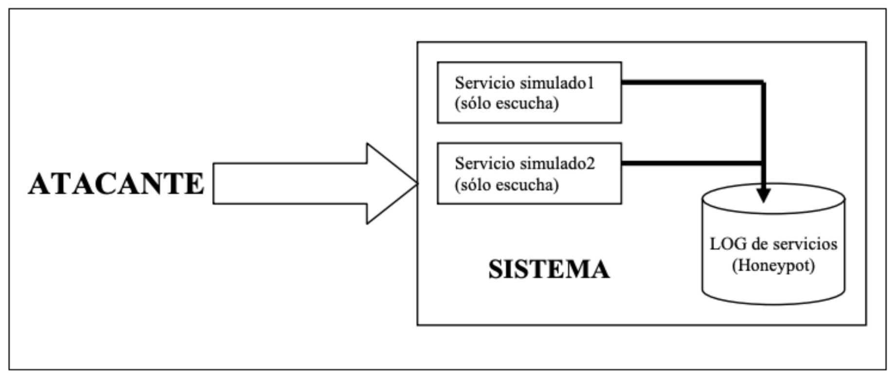

# Características

Una Honey Net es el honeypot más complejo, el que ofrece un nivel más alto de interacción con el intruso y el que permite recopilar mayor cantidad de información relativa a un ataque. Sin embargo, lejos de ser una herramienta empaquetada y lista para ser instalada, una Honey Net es una red completa que contiene un conjunto de sistemas dispuestos para ser atacados.

Una Honey Net puede contener cualquier componente de red imaginable, incluyendo routers y switches, lo que le permite replicar la red de cualquier organización. Este hecho, unido a que los equipos que contiene son sistemas reales con servicios y configuraciones habituales, hace que los riesgos y las vulnerabilidades que permite descubrir sean exactamente las mismas que se pueden encontrar en cualquier organización que cuente con sistemas similares a los expuestos.

Este tipo de redes ha ido evolucionando alrededor del Honey Net Project, organización creada oficialmente en junio del año 2000 con el objetivo de "Estudiar las técnicas, tácticas y motivos de la comunidad de atacantes y compartir las lecciones aprendidas". Este proyecto agrupa a miembros con perfiles muy distintos: expertos en los distintos sistemas operativos, desarrolladores de herramientas de seguridad, psicólogos, etc.

Aparte de los sistemas destinados a recibir los ataques, una Honey Net cuenta con un conjunto de dispositivos adicionales que le permiten detectar, filtrar y registrar tanto el tráfico que entra y sale de la red como las acciones de un intruso en el interior de un sistema de la red de señuelos tras su compromiso. Todo esto se realiza de forma pasiva, para que el intruso no note ningún comportamiento extraño que le induzca a pensar que está siendo vigilado. Las funciones de estos elementos son, de manera ampliada:

- Control del intruso. Cuando un honeypot del interior de la Honey Net sea comprometido por un intruso, será necesario tener la garantía de que no pueda ser utilizado para atacar otros sistemas que no pertenezcan a la Honey Net.
  Con este fin, es preciso controlar todas y cada una de las conexiones que el atacante trate de realizar desde el sistema comprometido, filtrando aquellas que puedan ser nocivas.
- Captura de datos. La clave del éxito de una Honey Net radica en su capacidad para capturar la mayor cantidad de información que sea posible, pues serán estos datos los que van a permitir estudiar las utilidades, tácticas y motivos de la comunidad de atacantes. Es fundamental capturar todo el tráfico que entre o salga de la Honey Net, así como cualquier actividad del intruso en el interior de un sistema comprometido.
- Centralización de información. Para conseguir un mejor rendimiento en escenarios con distintas Honey Nets dispersas por Internet es recomendable que la información capturada se envíe de forma segura a un servidor centralizado para su almacenamiento y análisis.
  De este modo se puede tener un mayor control sobre los datos recogidos, se pueden re-aprovechar experiencias y se puede obtener una imagen más clara de la evolución de los diferentes ataques presentes en La Red.

[Fuente](http://arantxa.ii.uam.es/~jlopezv/publicaciones/mundointernet04.pdf)
