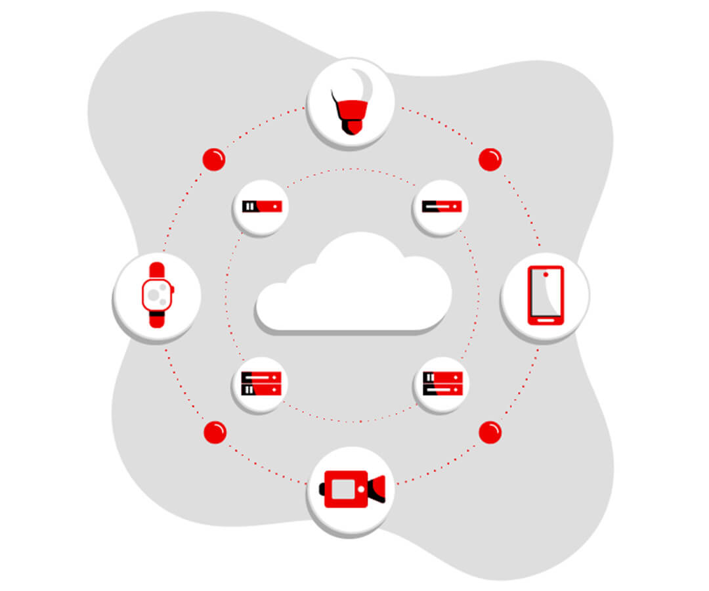

# Internet de las cosas

## ¿Qué es el Internet de las cosas?

El Internet de las cosas (IoT) es el proceso que permite conectar los elementos físicos cotidianos al Internet: desde los objetos domésticos comunes, como las bombillas de luz, hasta los recursos para la atención de la salud, como los dispositivos médicos; las prendas y los accesorios personales inteligentes; e incluso los sistemas de las ciudades inteligentes.

Los dispositivos del IoT que se encuentran dentro de esos objetos físicos suelen pertenecer a una de estas dos categorías: son interruptores (es decir, envían las instrucciones a un objeto) o son sensores (recopilan los datos y los envían a otro lugar).

## ¿Cómo funciona el internet de las cosas?

El término IoT hace referencia a los sistemas de dispositivos físicos que reciben y transfieren datos a través de las redes inalámbricas, con poca intervención humana. Es posible gracias a la integración de dispositivos informáticos en todo tipo de objetos.
Por ejemplo, un termostato inteligente (es decir, que utiliza el IoT) recibe los datos de la ubicación de su automóvil inteligente, y ambos dispositivos conectados le permiten ajustar la temperatura de su casa a pesar de que no se encuentre allí.

El funcionamiento de los sistemas de IoT tradicionales consiste en enviar, recibir y analizar los datos de forma permanente en un ciclo de retroalimentación. Según el tipo de tecnología de IoT, las personas o los sistemas de inteligencia artificial y aprendizaje automático (IA/ML) pueden analizar estos datos casi de inmediato o durante cierto tiempo.

Por ejemplo, para saber cuándo es ideal controlar el termostato antes de volver a casa, el sistema de IoT puede conectarse a la API de Google Maps y, de este modo, obtener información actual sobre el tráfico en el área. Además, puede utilizar los datos a largo plazo del automóvil para conocer sus hábitos de conducción. Por otra parte, las empresas de servicios públicos tienen la posibilidad de analizar los datos de IoT de los clientes con termostatos inteligentes para optimizar el sistema en general.

## IoT empresarial

Por lo general, el IoT capta la atención de los consumidores, cuyas experiencias con las tecnologías, como los relojes inteligentes, se ven afectadas por las preocupaciones en torno a la seguridad y la privacidad que supone el hecho de estar conectados de forma permanente. Esta perspectiva se aplica a todos los tipos de proyectos de IoT empresarial, especialmente cuando el usuario final es el público en general.

Las soluciones de IoT para las empresas les permiten mejorar los modelos comerciales actuales y entablar nuevas relaciones con los clientes y los partners, pero también implican ciertos desafíos.El volumen de datos que genera un sistema de dispositivos inteligentes (lo cual se conoce como big data) puede ser abrumador.El proceso de integración del big data en los sistemas actuales y la configuración del análisis de los datos para poder utilizar la información puede resultar complicado.

La seguridad es un aspecto muy importante que se debe considerar durante el diseño de los sistemas de IoT. Aun así, para muchas empresas vale la pena hacer el esfuerzo: hay casos prácticos exitosos en casi todos los sectores.

[Fuente](https://www.redhat.com/es/topics/internet-of-things/what-is-iot#%C2%BFqu%C3%A9-es-el-internet-de-las-cosas)
