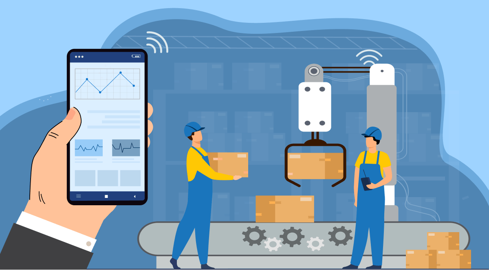

# IoT industrial

El IoT industrial consiste en maquinaria conectada a Internet y en avanzadas plataformas de análisis que procesan los datos que se producen. Los dispositivos IIoT van desde diminutos sensores ambientales hasta complejos robots industriales. Si bien la palabra «industrial» puede referirse a almacenes, astilleros y fábricas, las tecnologías IIoT son muy prometedoras para una amplia gama de sectores industriales, como la agricultura, la sanidad, los servicios financieros, el comercio minorista y la publicidad.

## ¿Cuál es la diferencia entre el IoT y el IIoT?

El IoT industrial es una subcategoría del Internet de las cosas, que también incluye aplicaciones orientadas al consumidor, como dispositivos portátiles, tecnología doméstica inteligente y automóviles sin conductor. La característica distintiva de ambos conceptos es la infraestructura, los sensores integrados en las máquinas y los dispositivos transmiten datos a través de Internet y se gestionan mediante software.

## ¿Por qué utilizar el IoT industrial?

Para cualquier negocio que se dedique a la producción y el transporte de bienes físicos, el IIoT puede crear procesos eficientes que innovan las tareas operativas y puede presentar modelos empresariales novedosos. Estos son algunos ejemplos de las maneras en que la tecnología del IIoT podría aplicarse en diversas industrias.

- Producción : esta es la industria en la que se está implementando la mayoría de la tecnología de IIoT. Las máquinas habilitadas para IIoT pueden autosupervisarse y predecir problemas potenciales, lo que representa menos tiempo de inactividad y mayor eficiencia general.
  Cadena de suministro : con el inventario gestionado por sensor, la tecnología IIoT podría encargarse de pedir suministros justo antes de que se agoten. Esto reduciría la cantidad de desperdicio producido al mantener los productos necesarios en stock y liberaría a los empleados para concentrarse en otras tareas.

- Gestión de edificios : la tecnología IIoT podría hacer que la gestión de edificios fuese más simple y segura. Con el control del clima gestionado por sensores, se eliminarán las conjeturas y la frustración que implica el cambio manual de la climatización de un edificio. Además, los dispositivos que supervisan los puntos de entrada en el edificio y responden rápidamente a las amenazas potenciales mejorarán la seguridad del edificio.

- Cuidado de la salud : con dispositivos que supervisan a cada paciente de forma remota y notifican a los proveedores de atención médica en cuanto cambia el estado de un paciente, el IIoT podría hacer que el cuidado de la salud sea más preciso y receptivo. Con el tiempo, la inteligencia artificial puede incluso hacerse cargo del diagnóstico del paciente, lo que significará que los médicos podrán atenderlos de manera más rápida y efectiva.

- Venta al por menor : en el caso de las tiendas individuales, la tecnología IIoT tiene el potencial de tomar decisiones de marketing rápidas e inteligentes. Con escaparates que se actualizan automáticamente según el interés del consumidor, y con la capacidad de armar promociones inteligentes, los puntos de venta que implementen la tecnología IIoT obtendrán una ventaja significativa sobre sus competidores.

## Tecnologías y conceptos del IIoT

¿Cómo están aprovechando el IIoT las empresas en este momento? Aquí hay algunos ejemplos de tecnologías y conceptos de IIoT actuales y futuros:

- Gemelos digitales : la práctica de crear un modelo informático de un objeto, como por ejemplo una máquina, un órgano humano o un proceso como el clima. Al estudiar el comportamiento del gemelo, es posible comprender y predecir el comportamiento de la contraparte en el mundo real y abordar los problemas antes de que ocurran.

- Dispositivo de registro electrónico (ELD) : sensores a bordo que supervisan la velocidad, el tiempo de conducción y la frecuencia con la que el conductor utiliza los frenos, ayudan a ahorrar combustible, mejoran la seguridad del conductor y reducen los recursos inactivos. Si el conductor hace una maniobra peligrosa o está al volante durante demasiado tiempo, recibirá una alerta, y se notifica también al despachador. Esta tecnología puede sustituir a los registros en papel que los conductores solían tener que rellenar cada día.

- Inteligencia en el extremo : el lugar donde los datos se generan, se analizan, se interpretan y se abordan. Usar la inteligencia en el extremo significa que el análisis se puede llevar a cabo más rápidamente y supone una reducción significativa de la probabilidad de que los datos sean interceptados o violados de alguna manera.

- Mantenimiento predictivo : un sistema que implica una máquina o un componente con sensores que recopilan y transmiten datos, y después los analizan y los almacenan en una base de datos. Esta base de datos proporciona puntos de comparación para los eventos a medida que ocurren. El sistema elimina el mantenimiento innecesario y aumenta la probabilidad de evitar fallos.

- Identificación por radiofrecuencia (RFID) : un sistema que incluye etiquetas y lectores, como una versión más inteligente de la tecnología de código de barras. Los lectores identifican las etiquetas RFID mediante ondas de radio, lo que significa que las etiquetas pueden ser leídas por múltiples lectores a la vez y a una distancia mayor que los códigos UPC tradicionales. Las etiquetas RFID hacen posible rastrear y supervisar fácilmente los objetos a los que están adheridas.

[Fuente](https://www.hpe.com/mx/es/what-is/industrial-iot.html)
