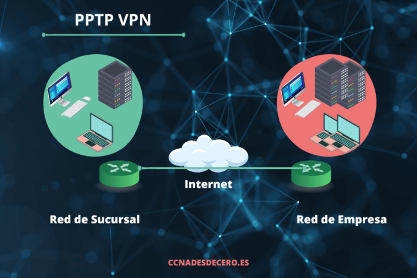

# Point to Point Tunneling Protocol

PPTP (del inglés Point to Point Tunneling Protocol) significa: protocolo de tunelización de punto a punto. El PPTP, que opera en el puerto TCP 1723, es uno de los protocolos VPN más antiguos en uso, siendo contemporáneo con Windows 95, y estándar en todas las versiones de Windows desde entonces. PPTP fue desarrollado gracias a una iniciativa de Microsoft para encapsular otro protocolo llamado PPP (Protocolo Punto a Punto).

De todos los protocolos VPN, PPTP es uno de los más comunes, más fáciles de configurar, y computacionalmente rápidos. Por esa razón, el PPTP es particularmente útil para aplicaciones en las cuales la velocidad es fundamental, como streaming de audio o video, o en dispositivos más antiguos y lentos, con procesadores más limitados.

Sin embargo, el PPTP también está expuesto a serias vulnerabilidades de seguridad. Sus protocolos de autenticación subyacentes, típicamente MS-CHAP-v1/v2, son fundamentalmente inseguros, y han sido descifrados en análisis de seguridad una y otra vez desde que el PPTP se introdujo por primera vez. Por esta razón, el PPTP NO se recomienda, excepto en los casos en los que la seguridad es absolutamente prescindible.

## ¿Cómo Funciona PPTP?

Si entiendes cómo funciona, te resultará más fácil configurar y solucionar los problemas de una VPN PPTP. Aquí tienes un resumen de los pasos a seguir:

PPTP sigue una arquitectura cliente-servidor en la que el servidor escucha en el puerto TCP 1723.
Una vez que un cliente VPN se conecta al puerto 1723, establecerás una “Conexión de Control“. A través de esta conexión puedes enviar información de control y gestión.

A continuación, establecerás un túnel GRE (Generic Routing Encapsulation). Este túnel encapsula los paquetes PPP. A su vez, estos paquetes transportan los datos que envíes a través de la VPN.

Como ya se ha mencionado, PPP ofrece funciones de seguridad. Microsoft Point-to-Point Encryption (MPPE) implementa el cifrado necesario. Además, el Microsoft Challenge Handshake Authentication Protocol (MS-CHAP) implementa la autenticación.

Es importante tener en cuenta que el Point-to-Point Tunneling Protocol no funciona bien con routers y firewalls. Tampoco funciona bien con otros dispositivos de red con capacidades de traducción de direcciones de red (NAT). Asegúrate de que tus dispositivos NAT tienen PPTP passthrough activado para evitar problemas de conectividad. Ahora te explicaré en qué consiste.

## ¿Qué es el PPTP Passthrough?

PPTP passthrough es una característica especial que se encuentra en los dispositivos de red equipados con NAT. Esta función permite a los protocolos VPN más antiguos “atravesar” el NAT sin impedimentos. Puedes considerar esta característica como un “VPN passthrough” en algunos dispositivos de red. Normalmente, cuando encuentres esta función, también encontrarás configuraciones de paso a través para protocolos VPN específicos.

PPTP y el Protocolo de Tunelización de Capa 2 (L2TP, Layer 2 Tunneling Protocol) suelen disponer de ajustes passthrough. Los protocolos más recientes, como OpenVPN, IKEv2/IPsec y WireGuard VPN ya disponen de funciones NAT-friendly. Por lo tanto, normalmente no encontrarás configuraciones passthrough para estos protocolos.

Para activar el paso a través, normalmente basta con hacer clic en un botón de opción o en un selector.

## Ventajas de Usar PPTP

Una VPN PPTP tiene todas las ventajas de una VPN. Estos beneficios incluyen proporcionar acceso remoto seguro a archivos, aplicaciones y hosts en una red privada a través de Internet. Pero, ¿por qué elegir este protocolo en lugar de otros protocolos VPN? A pesar de existir desde los años 90, este protocolo sigue prosperando. Esto se debe a dos ventajas principales.

### Reduce el Coste Total de Propiedad (TCO) de una VPN

Todas las versiones de Windows desde Windows 95 incluyen PPTP. Como todos sabemos, Windows ha dominado los entornos empresariales durante las últimas décadas. Esto significa que las organizaciones ya no tienen que comprar una solución independiente para adquirir una VPN. Del mismo modo, los administradores de sistemas ya no tienen que pasar por el aro para desplegar una VPN. Con este protocolo VPN, obtendrás una VPN gratuita fácilmente disponible en la plataforma más utilizada.

### Permite a los usuarios experimentar velocidades rápidas incluso cuando utilizan una VPN

Cuando los usuarios acceden a archivos y aplicaciones a través de una VPN, normalmente experimentan una disminución de la velocidad y la capacidad de respuesta. Esto ocurre debido a los procesos de cifrado y descifrado inherentes a las sesiones VPN. Sin embargo, experimentarás menos disminución con PPTP que con otros protocolos. Esto se debe a que utiliza un cifrado relativamente débil. Espera, ¿un cifrado débil no es malo? Ciertamente lo es, y esa deficiencia es uno de los mayores inconvenientes de usar este protocolo.

[Fuente](https://www.expressvpn.com/es/what-is-vpn/protocols/pptp)
