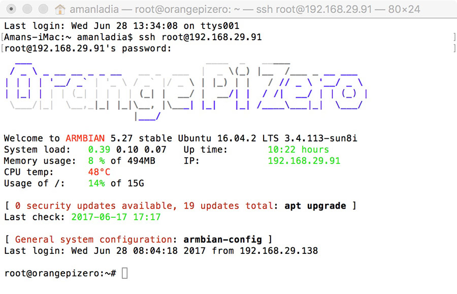

# SSH

SSH o Secure Shell, es un protocolo de administración remota que le permite a los usuarios controlar y modificar sus servidores remotos a través de Internet a través de un mecanismo de autenticación. Proporciona un mecanismo para autenticar un usuario remoto, transferir entradas desde el cliente al host y retransmitir la salida de vuelta al cliente. El servicio se creó como un reemplazo seguro para el Telnet sin cifrar y utiliza técnicas criptográficas para garantizar que todas las comunicaciones hacia y desde el servidor remoto sucedan de manera encriptada.

La imagen de abajo muestra una ventana típica de SSH. Cualquier usuario de Linux o macOS puede usar SSH en su servidor remoto directamente desde la ventana del terminal. Los usuarios de Windows pueden aprovechar los clientes SSH como Putty. Puedes ejecutar comandos shell de la misma manera que lo harías si estuvieras operando físicamente el equipo remoto.

## ¿Cómo funciona SSH?

Si usas Linux o Mac, entonces usar el protocolo SSH es muy fácil. Si utilizas Windows, deberás utilizar un cliente SSH para abrir conexiones SSH. El cliente SSH más popular es PuTTY, puedes aprender más acerca de él aquí.

Para usuarios de Mac y Linux, dirígete a tu programa de terminal y sigue este procedimiento:

El comando SSH consta de 3 partes distintas: `ssh {user}@{host}`

Este comando le indica a tu sistema que desea abrir una Conexión de Shell Segura y cifrada. {user} representa la cuenta a la que deseas acceder. Por ejemplo, puede que quieras acceder al usuario root, que es básicamente para el administrador del sistema con derechos completos para modificar cualquier cosa en el sistema. {host} hace referencia al equipo al que quieres acceder. Esto puede ser una dirección IP (por ejemplo, 244.235.23.19) o un nombre de dominio (por ejemplo, www.xyzdomain.com).

Al pulsar enter, se te pedirá que escribas la contraseña de la cuenta solicitada. Al escribirla, nada aparecerá en la pantalla, pero tu contraseña, de hecho, se está transmitiendo. Una vez que hayas terminado de escribir, pulsa enter una vez más. Si tu contraseña es correcta, verás una ventana de terminal remota.

## Comprendiendo las diferentes técnicas de cifrado

La ventaja significativa ofrecida por el protocolo SSH sobre sus predecesores es el uso del cifrado para asegurar la transferencia segura de información entre el host y el cliente. Host se refiere al servidor remoto al que estás intentando acceder, mientras que el cliente es el equipo que estás utilizando para acceder al host. Hay tres tecnologías de cifrado diferentes utilizadas por SSH:

1. Cifrado simétrico: es un método en el que la misma clave se utiliza tanto para cifrar como para descifrar la información. En este enfoque, tanto el remitente como el destinatario comparten una clave secreta, y esta clave se utiliza para proteger la confidencialidad de los datos. Los algoritmos de cifrado simétrico son eficientes y rápidos, pero el principal desafío radica en la distribución segura de la clave entre las partes involucradas.
2. Cifrado asimétrico: también conocido como cifrado de clave pública, utiliza un par de claves: una clave pública y una clave privada. La clave pública se comparte abiertamente y se utiliza para cifrar los datos, mientras que la clave privada, que solo el destinatario posee, se utiliza para descifrarlos. Este enfoque supera el desafío de la distribución segura de claves del cifrado simétrico y proporciona una mayor seguridad en términos de autenticidad y confidencialidad.
3. Hashing: es un proceso mediante el cual se toma una cantidad de datos y se produce una cadena de caracteres (hash) fija y única. Es una función unidireccional, lo que significa que no se puede recuperar la información original a partir del hash. Además, una pequeña modificación en los datos originales resulta en un hash completamente diferente. El hashing se utiliza comúnmente para verificar la integridad de los datos y almacenar contraseñas de forma segura. Un buen algoritmo de hashing produce hashes únicos y no reversibles.

## ¿Cómo funciona el protocolo SSH con estas técnicas de cifrado?

La forma en que funciona SSH es mediante el uso de un modelo cliente-servidor para permitir la autenticación de dos sistemas remotos y el cifrado de los datos que pasa entre ellos.

SSH opera en el puerto TCP 22 de forma predeterminada (aunque esto se puede cambiar si es necesario). El host (servidor) escucha en el puerto 22 (o cualquier otro puerto SSH asignado) para las conexiones entrantes. Organiza la conexión segura mediante la autenticación del cliente y la apertura del entorno de shell correcto si la verificación tiene éxito.

El cliente debe iniciar la conexión SSH iniciando el protocolo TCP con el servidor, asegurando una conexión simétrica segura, verificando si la identidad mostrada por el servidor coincide con los registros anteriores (normalmente grabados en un archivo de almacén de claves RSA) y presenta las credenciales de usuario necesarias para autenticar la conexión.

Hay dos etapas para establecer una conexión: primero ambos sistemas deben acordar estándares de cifrado para proteger futuras comunicaciones, y segundo, el usuario debe autenticarse. Si las credenciales coinciden, se concede acceso al usuario.

### Autenticación del usuario

La etapa final antes de que se conceda al usuario acceso al servidor es la autenticación de sus credenciales. Para ello, la mayoría de los usuarios de SSH utilizan una contraseña. Se le pide al usuario que introduzca el nombre de usuario, seguido de la contraseña. Estas credenciales pasan con seguridad a través del túnel cifrado simétricamente, así que no hay ninguna posibilidad de que sean capturadas por un tercero.

Aunque las contraseñas se cifran, todavía no se recomienda usar contraseñas para conexiones seguras. Esto se debe a que muchos robots pueden simplemente realizar ataque de fuerza bruta para descifrar contraseñas fáciles o predeterminadas y así obtener acceso a tu cuenta. En vez de eso, la alternativa recomendada es un par de claves SSH. Se trata de un conjunto de claves asimétricas utilizadas para autenticar al usuario sin necesidad de introducir ninguna contraseña.

[Fuente](https://www.hostinger.mx/tutoriales/que-es-ssh)
